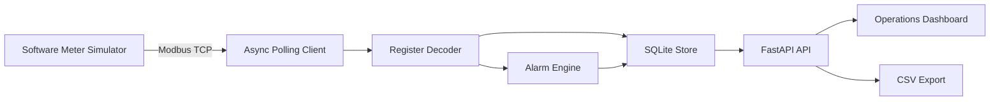
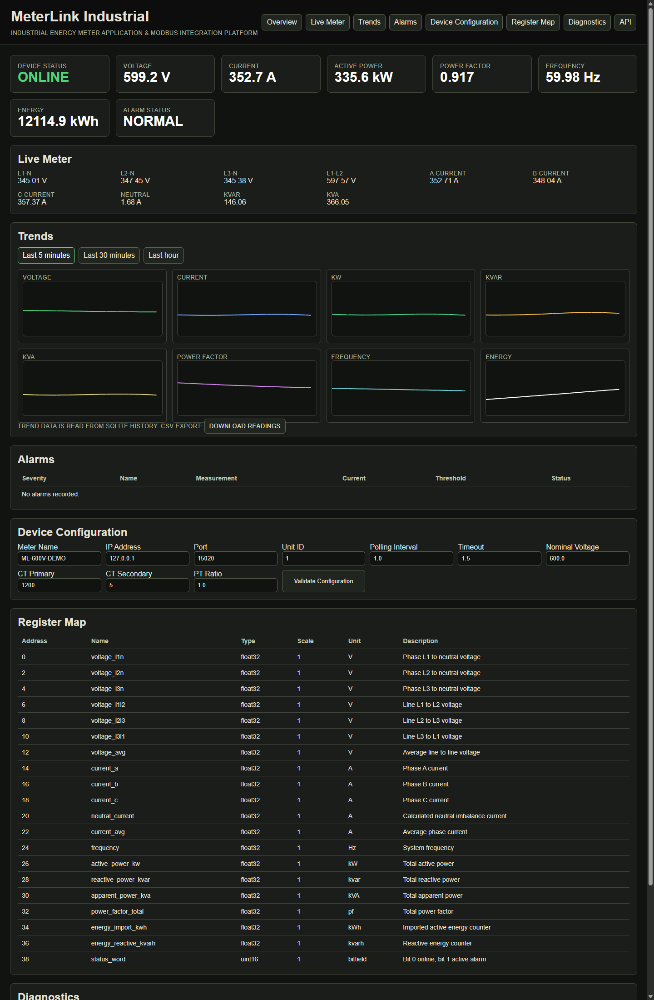
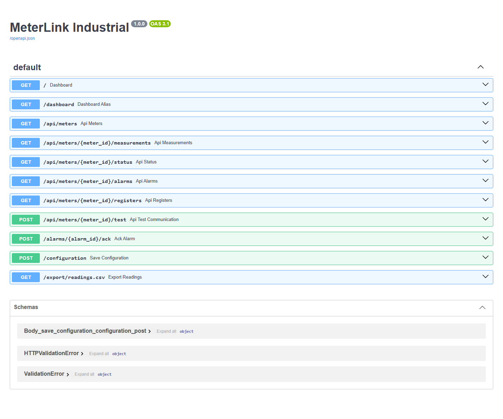

# MeterLink Industrial

Industrial energy meter application and Modbus integration platform.

MeterLink Industrial is a working FastAPI demo for monitoring an industrial three-phase energy meter over Modbus TCP. It includes a software meter simulator, an async polling client, a configurable register map, SQLite history, alarm logic, CSV export, Docker support, and a browser dashboard for application engineering demos.

This project uses synthetic electrical data only. It does not connect to real plant equipment unless you intentionally reconfigure it for a lab device.

## Why It Was Built

Industrial energy monitoring projects often fail at the handoff between controls, networking, and application teams. A usable system needs more than a protocol client: it needs a register map, connection diagnostics, validation, alarm behavior, local persistence, operator-facing UI, and deployment notes that explain how the system would move from demo to hardware.

MeterLink Industrial was built to show that full path.

## Live Demo

Live demo: deployment pending.

The public demo runs the same application pipeline as the local version: FastAPI starts an internal software Modbus TCP meter, the polling service reads holding registers, and the dashboard displays decoded measurements from SQLite history.

## Business Problem

Facilities teams need visibility into voltage, current, power, frequency, energy usage, and alarm conditions from plant-floor meters. Application engineers and solutions architects need a repeatable way to test the software side before physical meters are available.

This repository demonstrates a practical pattern:

- simulate the meter during development
- poll with Modbus TCP using a documented register map
- decode measurements reliably
- record history locally
- expose status through an API and dashboard
- package the system for local and free-tier deployment

## Features

- Software Modbus TCP energy meter simulator
- Configurable holding-register map in YAML
- Async Modbus TCP polling client using PyModbus
- Three-phase electrical values: voltage, current, neutral current, kW, kvar, kVA, power factor, frequency, kWh, kvarh
- Alarm engine for voltage, current, power factor, frequency, and active power
- SQLite reading and alarm history
- FastAPI REST API
- Jinja2 dashboard for live operations view
- Device configuration validation
- CSV export for readings
- Dockerfile and Docker Compose deployment
- Render free-tier deployment blueprint
- GitHub Actions CI with pytest and compile checks

## Architecture



See [docs/architecture.md](docs/architecture.md) and [diagrams/architecture.mmd](diagrams/architecture.mmd).

## Repository Structure

```text
config/                  register map and default device profile
data/                    local SQLite database path
diagrams/                architecture diagram source
docs/                    architecture, deployment, testing, and hardware notes
reports/                 generated demo reports
screenshots/             current dashboard screenshots
src/meterlink/           simulator, client, decoder, alarms, storage
tests/                   pytest suite
web/                     FastAPI app and dashboard template
```

## Local Setup

```powershell
python -m venv .venv
.\.venv\Scripts\Activate.ps1
pip install -r requirements.txt
pip install -e .
```

Run the web app with the built-in simulator:

```powershell
uvicorn web.main:app --host 0.0.0.0 --port 8000
```

Open:

```text
http://127.0.0.1:8000
```

## Docker Setup

Run the simulator and dashboard as separate services:

```powershell
docker compose up --build
```

Dashboard:

```text
http://127.0.0.1:8000
```

Modbus TCP simulator:

```text
127.0.0.1:15020
```

## Demo Workflow

1. Start the app locally or with Docker Compose.
2. Open the dashboard and confirm device status is `ONLINE`.
3. Review live voltage, current, power, frequency, energy, and alarm status.
4. Open `/api/meters/1/measurements` to inspect decoded meter readings.
5. Open `/api/meters/1/registers` to compare API output with the register map.
6. Download `/export/readings.csv` after the poller has collected samples.
7. Change `config/default_device.yaml` or environment variables to test validation and connection behavior.

## API Endpoints

- `GET /api/meters`
- `GET /api/meters/{meter_id}/measurements`
- `GET /api/meters/{meter_id}/status`
- `GET /api/meters/{meter_id}/alarms`
- `GET /api/meters/{meter_id}/registers`
- `POST /api/meters/{meter_id}/test`
- `GET /export/readings.csv`

Interactive API documentation is available at `/docs` when the app is running.

## Screenshots

Current screenshots are captured from the running demo application, not mocked.





## Configuration

Default settings live in `config/default_device.yaml`.

Environment overrides:

- `METERLINK_DEVICE_NAME`
- `METERLINK_MODBUS_HOST`
- `METERLINK_MODBUS_PORT`
- `METERLINK_UNIT_ID`
- `METERLINK_POLL_INTERVAL`
- `METERLINK_TIMEOUT`
- `METERLINK_RETRIES`
- `METERLINK_NOMINAL_VOLTAGE`
- `METERLINK_CT_PRIMARY`
- `METERLINK_CT_SECONDARY`
- `METERLINK_PT_RATIO`
- `METERLINK_DB`
- `METERLINK_START_SIMULATOR`

## Testing

```powershell
pytest -q
python -m compileall src web
```

CI runs the same checks on GitHub Actions.

## Deployment

The repository includes:

- `Dockerfile` for a single-container web demo
- `docker-compose.yml` for separate simulator and monitor services
- `render.yaml` for a free Render web service

See [docs/deployment.md](docs/deployment.md).

## Compliance And Safety

This is a synthetic demo. It does not claim production deployment, real energy savings, real customer usage, or live connection to plant equipment.

The included client reads holding registers only. Future write operations should require authentication, authorization, change approval, audit logs, and a tested rollback path.

## Future Roadmap

- Add vendor-specific register maps for common industrial meters
- Add trend downsampling for longer historical views
- Add Prometheus metrics export
- Add MQTT publishing for SCADA or data platform integration
- Add authenticated dashboard access
- Add Postgres support for durable hosted deployments
- Add hardware-in-the-loop tests against a lab meter

## License

MIT
