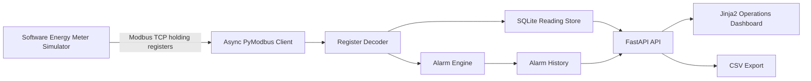

# Architecture

MeterLink Industrial is a demo industrial energy monitoring stack built around a software Modbus TCP meter, an asynchronous polling client, SQLite history, and a FastAPI dashboard.

The project is intentionally local and synthetic. It does not connect to a real facility meter by default, but the register map, polling loop, alarm evaluation, retry handling, and dashboard are shaped like the components used in a small industrial monitoring deployment.

## Runtime Modes

Local demo mode starts the simulator inside the FastAPI process and polls `127.0.0.1:15020`.

Docker Compose mode runs the simulator and dashboard as separate containers on the same Docker network. This better reflects a field deployment where the application connects to an external Modbus TCP endpoint.

## Data Flow

The simulator produces coherent three-phase electrical values: line voltage, phase current, active power, reactive power, apparent power, power factor, frequency, and energy counters.

The client reads a contiguous holding-register block, decodes values according to `config/register_map.yaml`, evaluates alarms, writes summary readings to SQLite, and exposes current state through API and dashboard routes.
